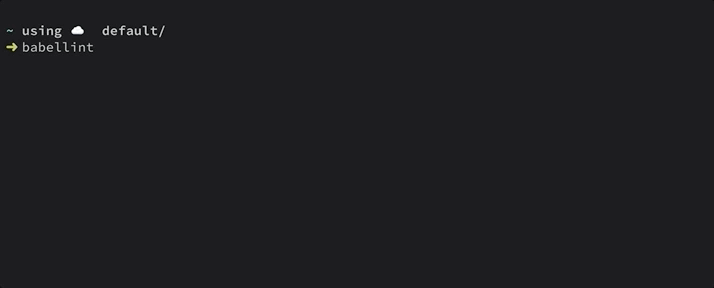

# babellint

Lints files using multiple third-party linters:



- Dockerfile: [hadolint](https://github.com/hadolint/hadolint/)
- JSON: [jq](https://github.com/stedolan/jq/)
- Markdown: [markdownlint](https://github.com/markdownlint/markdownlint)
- Python: [flake8](https://github.com/PyCQA/flake8)
- Shell scripts: [shellcheck](https://github.com/koalaman/shellcheck)
- YAML: [yamllint](https://github.com/adrienverge/yamllint)


## Usage


### Command line

```sh
alias babellint='docker run --rm --interactive --tty -v $(pwd):$(pwd) -w $(pwd) ghcr.io/heussd/babellint:main'
```


#### Linting specific files

```sh
babellint docker-compose.yml
babellint README.md
```


#### Linting all files of a git repository

```sh
cd $gitroot
babellint
```


### GitHub Actions

```yml
- name: Babellint
  uses: heussd/babellint@main
```

[Babellint is also using the babellint GitHub Action to ... babellint.](.github/workflows/babellint.yml)
